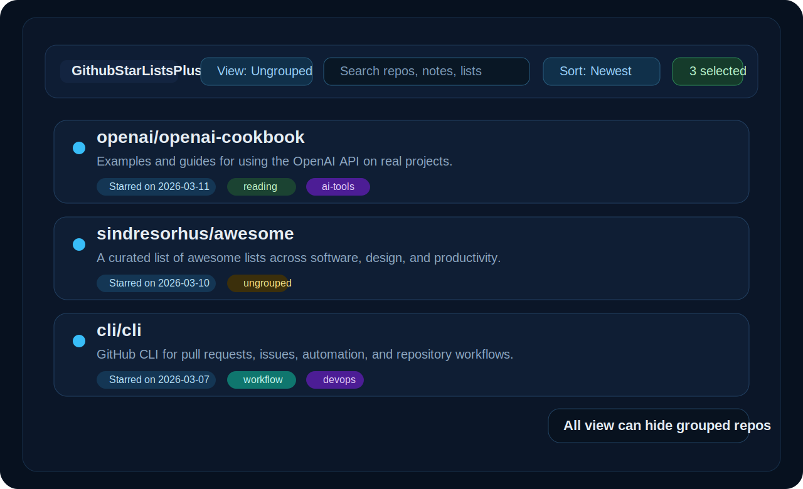
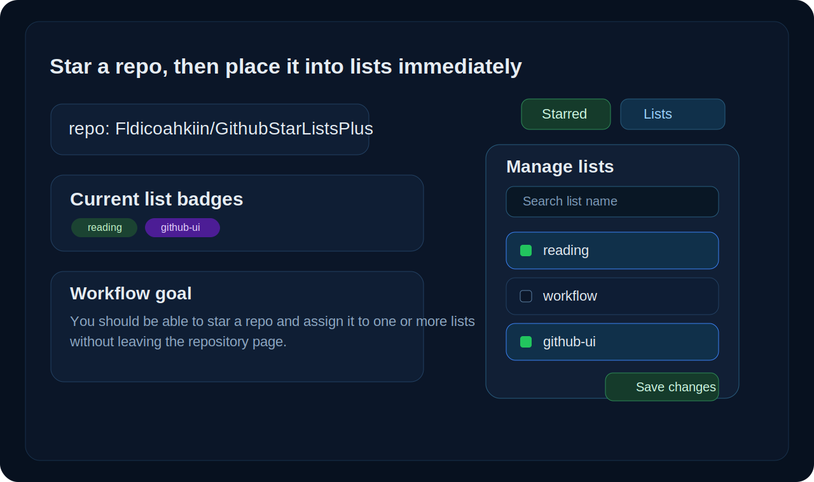

# GithubStarListsPlus

[](https://github.com/Fldicoahkiin/GithubStarListsPlus/actions/workflows/ci.yml)
[](./README.md)
[](https://www.tampermonkey.net/)

GithubStarListsPlus 把 GitHub starred lists 从“被动归档”变成“主动整理”的工作流。

产品名和仓库 slug 现在统一为 **GithubStarListsPlus**。

英文主文档请跳转到 [README.md](./README.md)。

## 预览图

### Stars 页面：未分组清理视图



### 仓库页面：Star 后立即归类



## 目录

- [为什么做 GithubStarListsPlus](#为什么做-githubstarlistsplus)
- [核心亮点](#核心亮点)
- [支持运行形态](#支持运行形态)
- [配置方式](#配置方式)
- [兼容矩阵](#兼容矩阵)
- [安装方式](#安装方式)
- [CI 产物](#ci-产物)
- [权限与隐私](#权限与隐私)
- [项目结构](#项目结构)
- [开发与测试](#开发与测试)
- [路线图](#路线图)
- [常见问题](#常见问题)

## 为什么做 GithubStarListsPlus

GitHub 已经有 starred repos 和官方 lists，但默认体验仍有一个明显缺口：Star 很快，整理很慢，而且往往会被无限拖延。

GithubStarListsPlus 不重建一套系统，而是直接增强 GitHub 原生工作流：

- 不引入平行数据库
- 不另造 list 体系
- Star 后可以立刻归类
- 把 `未分组` 变成真正可操作的整理入口

## 核心亮点

### Stars 页面

- `全部`、`未分组`、已发现 lists 的切换
- `全部` 视图支持隐藏已分组仓库
- 卡片直接显示 `Starred on ...`
- 卡片显示 list 标签
- 支持本地搜索仓库名、描述和 list 名
- 支持按 Star 时间排序
- 支持批量选择和批量取消 Star

### 仓库页面

- 在原生 Star 区域旁加入 `Lists` 操作入口
- 在按钮附近显示缓存的 list 标签
- 支持搜索、多选和保存
- Star 后可自动弹出分组面板

## 支持运行形态

### 扩展形态

- Chrome
- Edge / Brave 等 Chromium 浏览器
- Firefox

### Userscript 形态

- Tampermonkey
- Violentmonkey
- 其他 GM 兼容管理器可能可用，但暂时不是主要目标

当前代码通过一层兼容封装同时支持 callback 风格 `chrome.*` API、Promise 风格 `browser.*` API，以及 GM 风格 userscript API。

## 配置方式

### 扩展设置页

当前设置页已经覆盖核心工作流开关：

- 在 `https://github.com/stars` 显示 Star 日期
- 在 `全部` 中隐藏已分组仓库
- 在卡片和仓库页显示 list 标签
- Star 后自动打开 list 面板
- 可选 GitHub token，用于提升 API 配额和 `starred_at` 获取成功率

### Userscript 设置流

userscript 暂时没有独立设置页，而是通过 GM 菜单命令提供：

- 主功能开关切换
- 保存或清空 GitHub token
- 清理缓存并重新加载页面

## 兼容矩阵

| 运行形态 | 安装路径 | 当前状态 | 说明 |
| --- | --- | --- | --- |
| Chrome / Edge / Brave | MV3 扩展 | 支持 | 预发布阶段通过 CI 产物手动加载 |
| Firefox | 带 `gecko` 元数据的 MV3 扩展 | 支持 | 当前以临时安装为主，后续再接签名 |
| Tampermonkey | userscript | 支持 | 适合低门槛试用 DOM 增强能力 |
| Violentmonkey | userscript | 支持 | 复用同一个生成出的 `.user.js` 包 |


## 安装方式

### Chrome / Edge / Brave

当前预发布安装方式：

1. 打开 `chrome://extensions`
2. 开启开发者模式
3. 从 [Actions](https://github.com/Fldicoahkiin/GithubStarListsPlus/actions/workflows/ci.yml) 下载最新 CI 产物
4. 解压 `github-star-lists-plus-chrome-unpacked.zip`
5. 点击 `Load unpacked` 并选择解压目录

### Firefox

当前预发布安装方式：

1. 打开 `about:debugging#/runtime/this-firefox`
2. 从 [Actions](https://github.com/Fldicoahkiin/GithubStarListsPlus/actions/workflows/ci.yml) 下载最新 CI 产物
3. 使用 `firefox-unsigned` 目录或 `github-star-lists-plus-firefox-unsigned.xpi`
4. 点击 `Load Temporary Add-on`，选择目录里的 `manifest.json` 或 unsigned `.xpi`

### Tampermonkey / Violentmonkey

当前预发布安装方式：

1. 安装 [Tampermonkey](https://www.tampermonkey.net/) 或 [Violentmonkey](https://violentmonkey.github.io/)
2. 从 [Actions](https://github.com/Fldicoahkiin/GithubStarListsPlus/actions/workflows/ci.yml) 下载最新 CI 产物
3. 打开 `github-star-lists-plus.user.js`
4. 在 userscript 管理器里确认安装

## CI 产物

项目当前会在每次 `push`、`pull_request`、`workflow_dispatch` 时生成安装产物。

工作流：[`CI`](https://github.com/Fldicoahkiin/GithubStarListsPlus/actions/workflows/ci.yml)

每次成功运行会上传：

- `chrome-unpacked/` - Chromium 开发者模式加载目录
- `github-star-lists-plus-chrome-unpacked.zip` - Chromium 解压包
- `firefox-unsigned/` - Firefox 临时加载目录
- `github-star-lists-plus-firefox-unsigned.xpi` - unsigned Firefox 包
- `github-star-lists-plus.user.js` - Tampermonkey / Violentmonkey 可安装 userscript
- `checksums.txt` - 打包文件的 SHA-256 校验值
- `install-notes.txt` - 产物内附带的安装说明
- `artifact-metadata.json` - 扩展名、版本号和归档校验信息

暂时还没有接 release 自动发布，等扩展更稳定后再切到 tag/release 触发。

## 权限与隐私

GithubStarListsPlus 故意把数据面控制得很小：

- `storage`：保存本地设置、list 目录缓存和 `starred_at` 缓存
- `https://github.com/*`：读取当前页面 DOM，并复用 GitHub 原生 list 流程
- `https://api.github.com/*`：读取 `starred_at` 元数据，以及在你主动触发时执行取消 Star 请求

项目不接入外部分析服务、没有远端跟踪，也没有单独的 GithubStarListsPlus 后端。如果你填写 GitHub token，它只会保存在本地扩展存储或 userscript 管理器存储中，并且仅用于 GitHub API 请求。

## 项目结构

- `manifest.json` - Chrome / Firefox 共用扩展清单
- `src/userscript/*` - userscript 适配层和 GM 菜单命令
- `src/background.js` - Chrome / Firefox 扩展侧的 GitHub API 桥接
- `src/content.js` - stars 页面与仓库页增强逻辑
- `src/options.*` - 扩展设置页
- `src/shared/*` - 各运行目标共用的运行时、存储和服务逻辑
- `docs/images/*` - README 预览图
- `tests/extension-smoke.mjs` - 运行时兼容和 manifest smoke test
- `tests/artifact-smoke.mjs` - 构建产物与 userscript bundle smoke test
- `scripts/test-extension.sh` - 本地 smoke test 入口
- `scripts/build_artifacts.py` - 为扩展与 userscript 生成 CI 安装产物

## 开发与测试

### 本地 smoke test

```bash
bash ./scripts/test-extension.sh
```

当前覆盖：

- 扩展脚本语法检查
- Chrome callback API 兼容
- Firefox Promise API 兼容
- 双浏览器 manifest 关键字段检查
- 构建产物打包检查
- userscript 构建检查

### 本地生成安装包

```bash
python3 ./scripts/build_artifacts.py
```

输出目录为 `dist/`。

## 路线图

- 在 stars 页面工具条中加入批量加入 / 移出 lists
- 提升仓库页原生 list 菜单解析的稳健性
- 增加 popup 或更快的设置入口
- 等扩展成熟后，把安装包从 CI 产物切换到 release 发布
- 尽量让 userscript 目标和扩展目标保持核心能力一致

## 常见问题

### 为什么不单独建数据库？

因为产品目标是增强 GitHub 原生 stars 和官方 lists，而不是替换它们。

### 现在 CI 产物能直接安装吗？

可以，但不同形态的安装方式不同。

- Chromium 浏览器在开发阶段仍以 `Load unpacked` 为主，除非后续进入 Chrome Web Store 或企业分发。
- Firefox 的永久安装需要签名，但当前 unsigned `.xpi` 适合临时开发加载。
- Tampermonkey 和 Violentmonkey 可以直接安装生成出来的 `.user.js`。

### 为什么 manifest 里有 Firefox 的 `gecko.id`？

因为 Firefox 通过 `browser_specific_settings.gecko` 保存浏览器特定元数据和扩展 ID。

### 为什么还要支持 userscript？

因为 userscript 管理器对 DOM 增强类功能的试用门槛很低，而浏览器扩展仍然是长期主线分发方式。

### 为什么 manifest 里同时保留 `background.service_worker` 和 `background.scripts`？

因为项目要同时覆盖 Chrome 风格的 MV3 service worker 和 Firefox 当前的 MV3 background script 运行方式，所以 manifest 需要保留双目标配置，才能共用同一套源码。
